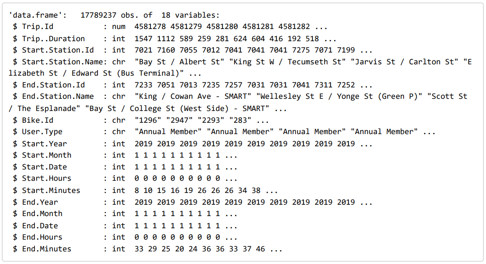

# Urban Pedals: Unveiling Toronto’s Bike Share Story Using R

A repo of project for Humber Big Data Course regarding Bike-share ridership.

## Overview

This repository contains the code and data for a data analysis project focused on exploring the ridership patterns of the bike-share scheme in Toronto. The analysis is conducted using the R programming language to gain insights into user behaviors, popular routes, and temporal trends.

---

## Data Source

- Ref:
  - https://open.toronto.ca/dataset/bike-share-toronto-ridership-data/

- Data Summary:

---

## Workloads Overview

- [x] Download and import dataset
- [x] Data Processing
- [x] Trips
  - [x] Yearly Trips Trends
  - [x] Monthly Pattern
  - [x] Hourly Pattern
- [x] Duration
  - [x] Yearly Trips Trends
  - [x] Monthly Pattern
  - [x] Hourly Pattern
- [x] Geolocation Analysis
  - [x] Hot Start Locations
  - [x] Hot End Locations
  - [x] Hot Trips

---

## Documentation

- [Urban Pedals](./Urban%20Pedals_%20Unveiling%20Toronto’s%20Bike%20Share%20Story.pdf)
